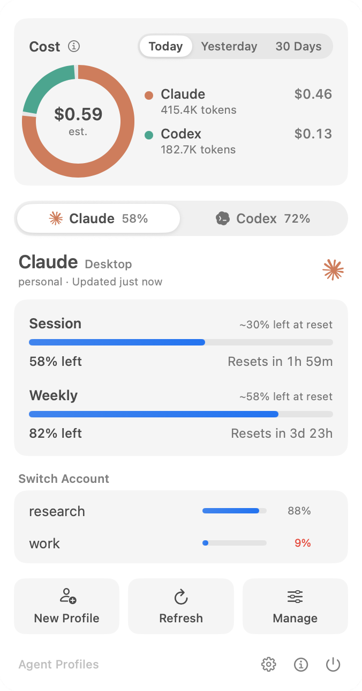

# Agent Profiles


A macOS menu bar app for switching Claude and Codex accounts and keeping an
eye on their usage limits. It merges
[Claude Profiles](https://github.com/ajipurn/claude-profiles) and
[Codex Profiles](https://github.com/ajipurn/codex-profiles) into one app.



Requires macOS 14 or later, on Apple Silicon or Intel.

Independently developed. Not affiliated with or endorsed by Anthropic or OpenAI.

## Install

1. Download `AgentProfiles-<version>.zip` from [Releases](https://github.com/ajipurn/agent-profiles/releases/latest).
2. Unzip it and move **Agent Profiles.app** to **Applications**.
3. Quit Claude Profiles and Codex Profiles if you use them; Agent Profiles picks up their profiles and accounts as they are.
4. Open Agent Profiles and click its icon in the menu bar.

### "Agent Profiles" Not Opened

Releases are ad-hoc signed and **not Apple-notarized** (that needs a paid Apple Developer account), so the first launch shows *"Apple could not verify “Agent Profiles” is free of malware…"*. Nothing was detected; macOS shows this for every app that is not notarized. After checking where the download came from, pick one of these once:

**System Settings (macOS 15 and later)**

1. In the warning, click **Done**, not "Move to Trash".
2. Open **System Settings → Privacy & Security** and scroll down to *"Agent Profiles" was blocked…*.
3. Click **Open Anyway** and confirm with your password or Touch ID.

**Terminal**: remove the quarantine mark directly, then open the app as usual:

```sh
xattr -dr com.apple.quarantine "/Applications/Agent Profiles.app"
```

macOS does not ask again for this copy. Later versions arrive through the app's own updater, which verifies Sparkle's Ed25519 signature before installing. Building from source (see below) avoids the warning entirely.

## Try it

```sh
make test   # Codex checks + Claude core tests
make demo   # preview mode: sample accounts in temporary folders
make run    # real mode: manages your actual accounts
```

Preview mode (`--demo`) keeps its sample accounts in temporary folders and never
quits or relaunches Claude or ChatGPT, so it is safe to run next to the old
apps. It also opens Settings right away.

Real mode works on the same files as the old apps. If Claude Profiles or Codex
Profiles is running, it asks to quit them first and does not start otherwise.

## What it looks like

The panel follows [OpenUsage](https://github.com/robinebers/openusage)'s design:

- **Menu bar:** a two-bar icon, with the session window on top and the weekly
  window below, plus the session percentage. It follows the frontmost Claude
  or Codex app, or the provider picked in Settings → General.
- **Panel (click the icon):** estimated cost (Today, Yesterday, 30 Days) as a
  ring per provider, Claude | Codex tabs, the selected provider's card
  (account, freshness, Session and Weekly bars with reset countdowns and
  pace), the other accounts to switch to, and actions. Claude also gets a
  Claude Code profile picker once CLI profiles are set up.
- **Pace:** a bar stays blue while the current burn rate leaves at least 10%
  at the reset, turns yellow when it would land in the last 10%, and red with
  the projected run-out time when it would run out first. Yellow and red bars
  show a tick where an even burn would be.
- **Cost:** read from local Claude Code (`~/.claude/projects`, and each CLI
  profile) and Codex (`~/.codex/sessions`) logs and priced at API list rates
  from a bundled [LiteLLM](https://github.com/BerriAI/litellm) snapshot
  (`python3 scripts/update-pricing.py` refreshes it), including Codex's
  priority and flex tiers, long-context rates, Claude's fast mode, US-only
  inference and web searches. It is an estimate:
  Claude Desktop chats keep no local token log, and on a subscription it is
  the value of what you used, not a bill. Nothing leaves your Mac.
- **Settings window:** General (menu bar, launch at login, updates), Claude
  (profiles, Desktop and CLI switching, rename, delete, order, shared session
  history, CLI setup), Codex (accounts, favorites, rename, remove, sign-in,
  options), About.

Everything both old apps did is still there.

The app icon, a dial with two gauge arcs chasing each other in Claude's orange and Codex's blue,
is drawn in code: `swift scripts/make-icon.swift` regenerates
`Resources/AppIcon.icns` and `docs/icon.png`.

## Existing logins

No sign-in step for sessions that are already on the Mac:

- **Codex:** a login in `~/.codex/auth.json` that no saved account matches is
  saved automatically, named after its email. Removing the active account
  in Settings keeps it from being saved again.
- **Claude:** if Claude is signed in but profiles were never set up, the
  current login becomes the first profile ("main") on its own, but only
  while Claude.app is quit, so nothing restarts. With Claude running, use
  Set Up Profiles… in the menu. All profiles can be deleted, including the
  active and last profile. Deleting the active Desktop profile closes Claude
  and removes its folder link; it stays closed afterwards. Deleting the active
  or last Desktop profile also stops automatic setup until you choose
  Set Up Profiles… again. You can keep only Claude or only Codex profiles.

## Shortcuts and scripting

- **⌘⌥1…9:** switch to the Nth Claude profile, in the order set in Settings.
- **⌃⌥1…9:** switch to the Nth Codex account, favorites first, then by name.
- **URLs** (Raycast, Alfred, shell):

  | URL | Does |
  | --- | --- |
  | `agentprofiles://claude/<name>` | switches Claude Desktop |
  | `agentprofiles://claude-cli/<name>` | switches the Claude Code profile (`Default` = plain `~/.claude`) |
  | `agentprofiles://codex/<name>` | switches Codex (saved name, label or email) |
  | `agentprofiles://open[/<pane>]` | opens Settings (`general`, `claude`, `codex`, `about`) |

  Claude Profiles' `claudeprofiles://switch|switch-cli|open` still work.
- **Notifications:** a switch started from the menu, a hotkey or a URL
  reports when it is done. When the active account of either provider drops
  to 10% of its session window, a notification suggests the account with
  the most left; clicking it switches.

## Compatibility with the old apps

These must not change, or existing installs break:

- `~/Library/Application Support/Claude-Profiles/` stays where it is. The
  `Claude` symlink points into it, Claude Code ties each CLI profile's login to
  its folder path, and users' `~/.zshrc` puts `_cli/bin` on `PATH`.
- `~/Library/Application Support/CodexProfiles/` stays where it is.
- The `claudeprofiles://` URL scheme stays registered.
- Agent Profiles never runs at the same time as either old app (checked at
  launch).

## Layout

```
Sources/CZstd/                  vendored zstd, decompress only (BSD)   ← claude-profiles
Sources/ClaudeProfilesCore/     Claude profile logic, no UI            ← claude-profiles
Sources/CodexProfilesCore/      Codex profile logic, no UI             ← codex-profiles
Sources/UsageCostCore/          cost estimate from local logs, no UI
Sources/AgentUI/                panel cards, bars, cost ring, switcher, menu bar icon (shared)
Sources/CodexProfilesUI/        Codex model, settings pane, updater    ← codex-profiles
Sources/AgentProfiles/          app shell, panel, Settings, Claude pane ← claude-profiles
Tests/ClaudeProfilesCoreTests/  Swift Testing (ported from XCTest)
Tests/UsageCostCoreTests/       Swift Testing
Tests/CodexProfilesCheck/       plain executable checks
```

The code was imported from codex-profiles@47210c3 and claude-profiles@0c934d9.
The first commit holds it unchanged; the second holds the changes for the
merge. Earlier history stays in the original repositories.

Every target builds in Swift 6 language mode (strict concurrency).

## Building without Xcode

The scripts need only the Command Line Tools. They use SwiftPM's native build
system and, when the default SDK is macOS 27, build against the macOS 26 SDK.
`scripts/swift-env.sh` explains why. Set `SDKROOT` or `SWIFT_BUILD_SYSTEM` to
override.

## Next

- A last release of Claude Profiles and Codex Profiles that points their users
  here.

See [Privacy](PRIVACY.md), [Security](SECURITY.md), [Contributing](CONTRIBUTING.md) and the [release guide](docs/RELEASING.md).

## License

[MIT](LICENSE). Bundled dependencies keep their own
[licenses and notices](THIRD_PARTY_NOTICES.md).
